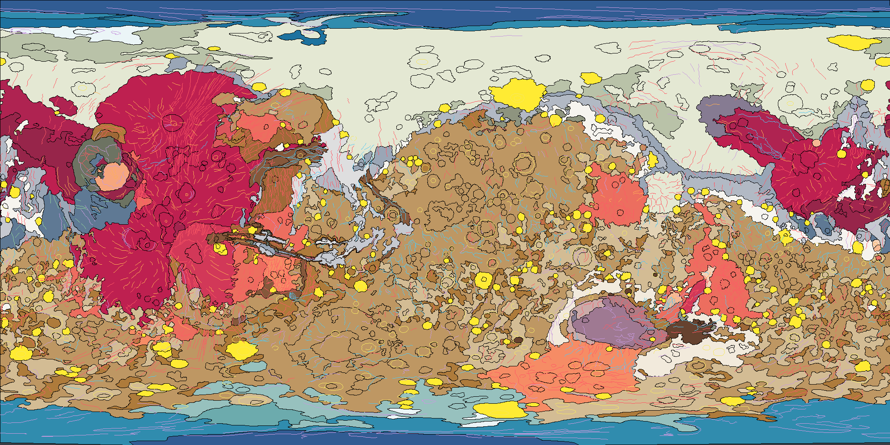

# Mars · Global Geologic Map — Interactive 3D

An interactive, clickable 3D geologic map of Mars in a **single self-contained HTML file**. Every rock unit from the USGS global geologic map is rendered on a WebGL globe and carries its full geologic dossier: description, stratigraphic relations, interpretation, crater-density statistics, absolute model ages, and type locality.

**Live demo:** `https://<your-username>.github.io/mars-geologic-map/` *(enable GitHub Pages — see Deploy below)*

---

## Features

- **Clickable geology** — tap any outcrop to identify the unit; the info panel shows morphology & thickness, stratigraphy & superposition relations, genetic interpretation, and the official type area with fly-to buttons. Unit labels inside the relations text are live cross-references, so you can walk the stratigraphic column contact by contact.
- **Correlation of Map Units** — the epoch × group chart from sheet 2 of the printed map, rebuilt as an interactive legend. Click a unit chip to highlight every outcrop of that unit on the globe.
- **Quantitative data per unit** — cumulative crater densities N(1), N(2), N(5), N(16) per 10⁶ km² with Poisson errors; mean elevation and slope from MOLA; absolute model-age ranges in both the Hartmann and Neukum chronology systems. Units that were never directly crater-dated say so explicitly rather than pretending data exists.
- **Structures layer** — 3,593 mapped features (wrinkle ridges, graben axes, channel axes, scarps, lobate flows, crater rims, yardangs and more), color-coded by origin.
- **Nomenclature & landing sites** — 400 IAU-named features with search and fly-to; 15 landing sites from Mars 3 onward.
- **MOLA hillshade** — optional real relief streamed from NASA Trek WMTS tiles and blended under the geology (works when hosted; requires network).
- **Touch-first controls** — 1:1 finger-tracking rotation, flick momentum with smooth decay, isolated pinch-zoom, double-tap to dive in, collapsible layer panel for an unobstructed globe on phones.
- **Progressive resolution** — boots fast at 4096 px (2048 mobile), then silently re-rasterizes at 8192×4096 (4096×2048 mobile) in idle time.

## Controls

| Action | Desktop | Mobile |
|---|---|---|
| Rotate | drag | one-finger drag (with flick momentum) |
| Zoom | scroll wheel | pinch |
| Identify unit | click | tap |
| Dive to point | double-click | double-tap |
| Locate a unit everywhere | click its chip in the correlation chart | same |
| Find a feature | search box (e.g. *olympus*, *hellas*) | same |

## Architecture

No build step, no server, no dependencies to install. The file embeds:

- **1,311 unit polygons** (44 units, ~325k vertices) simplified topology-preserving from the USGS SIM 3292 geodatabase, with a repaired north-polar-cap pole closure
- The full **Description of Map Units** text, crater statistics, and topographic statistics as JSON
- All rendering via [three.js](https://threejs.org) r128 (the only external resource, loaded from cdnjs)

The geologic map texture is rasterized from the vector data onto a canvas at runtime and mapped onto a sphere; clicks are resolved by ray-sphere intersection → lat/lon → even-odd point-in-polygon lookup against the original vectors (~0.04 ms per query). Selection highlighting, structures, and the graticule are composited canvas layers.

## Deploy

1. Put `index.html` (this app) and `preview.png` in a repo.
2. **Settings → Pages → Deploy from branch** → `main`, root.
3. Done. The MOLA hillshade toggle becomes functional once hosted (NASA Trek allows cross-origin tile requests over HTTPS).

Netlify / Cloudflare Pages drag-and-drop works identically.

## Data sources

All scientific content is from U.S. government publications (public domain):

- **Tanaka, K.L., Skinner, J.A., Jr., Dohm, J.M., Irwin, R.P., III, Kolb, E.J., Fortezzo, C.M., Platz, T., Michael, G.G., and Hare, T.M. (2014).** *Geologic map of Mars.* U.S. Geological Survey Scientific Investigations Map 3292, scale 1:20,000,000. https://dx.doi.org/10.3133/sim3292 — unit polygons, structures, and Description of Map Units.
- **Tanaka, K.L., Robbins, S.J., Fortezzo, C.M., Skinner, J.A., Jr., and Hare, T.M. (2014).** *The digital global geologic map of Mars: Chronostratigraphic ages, topographic and crater morphologic characteristics, and updated resurfacing history.* Planetary and Space Science 95, 11–24. https://doi.org/10.1016/j.pss.2013.03.006 — per-unit crater densities (from the Robbins & Hynek 2012 crater database) and elevation/slope statistics.
- **Werner, S.C., and Tanaka, K.L. (2011).** *Redefinition of the crater-density and absolute-age boundaries for the chronostratigraphic system of Mars.* Icarus 215, 603–607 — epoch boundary model ages (Hartmann and Neukum chronologies).
- **IAU Gazetteer of Planetary Nomenclature** — feature names and coordinates.
- **NASA Mars Trek** (https://trek.nasa.gov/mars/) — MOLA hillshade WMTS tiles.

Unit colors follow the published USGS map. Shapefile access and unit color/description wrangling courtesy of [Eleanor Lutz's *Geologic Maps of Mars* repository](https://github.com/eleanorlutz/mars_geology_atlas_of_space).

### Accuracy notes

- **Outcrop area** in the info panel sums the mapped polygons and excludes superposed AHi (impact) materials, so it runs slightly below published unit totals, which reassimilate AHi into underlying units.
- The correlation chart derives each unit's epoch span from its label per the pamphlet's convention; the printed sheet-2 chart draws a few boxes narrower based on additional dating detail.
- Geometry is simplified from 1:20,000,000 source mapping for web delivery; it is a reference visualization, not a substitute for the USGS GIS data in analytical work.

## License

Code: MIT. Scientific data: public domain (USGS/NASA); please cite the sources above in any derivative scientific use.

---

Built by **Billy Romero** · BROM Arts and Engineering LLC · Santa Fe, NM
